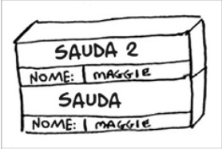

## EXERCÍCIOS

### 3.1 Suponha que eu forneça uma pilha de chamada como esta:

### Quais informações você pode retirar baseando-se apenas nesta pilha de chamada?

### Agora, vamos ver esta pilha de chamada sendo executada com uma função recursiva.

**Resposta:** A partir dessa imagem podemos perceber que:

<ul>
    <li>
        Sauda foi chamada primeiro com nome = Maggie
    </li>
    <li>
        Sauda chama a funçao Sauda 2 com nome = Maggie
    </li>
    <li>
        Neste momento sauda fica em modo suspeso
    </li>
    <li>
        Sauda 2 é chamada, executada e finalizada
    </li>
    </li>
    <li>
        Sauda é chamada, executada e finalizada
    </li>
</ul>

---

###  3.2 Suponha que você acidentalmente escreva uma função recursiva que que executando innitamente. Como você viu, seu computador aloca memória na pilha para cada chamada de função. O que acontece com a pilha quando a função recursiva fica executando innitamente?
**Resposta:** Como o computador vai alocando memória a cada chamada de função e não há uma parada, ira chegar no limite de memória do computador, acontecendo o famoso estorou de pilha de execução ou StackOverflow.

---
